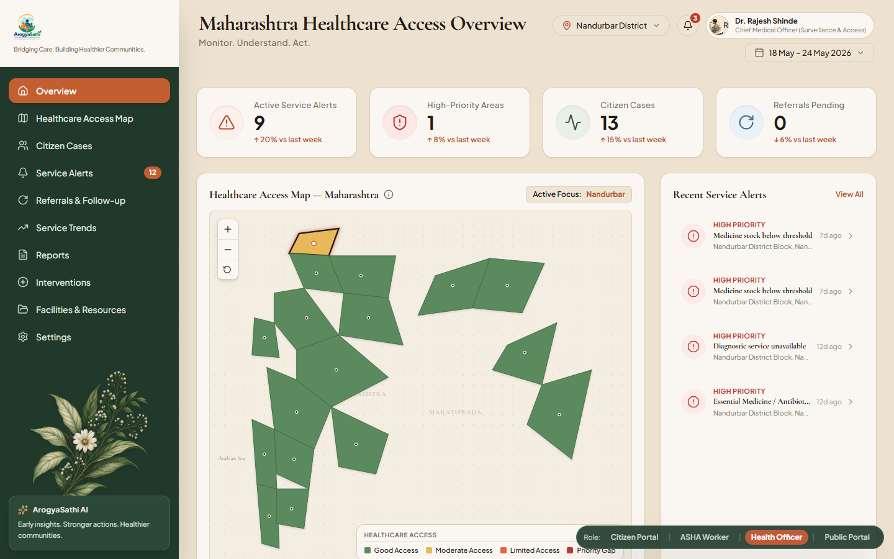
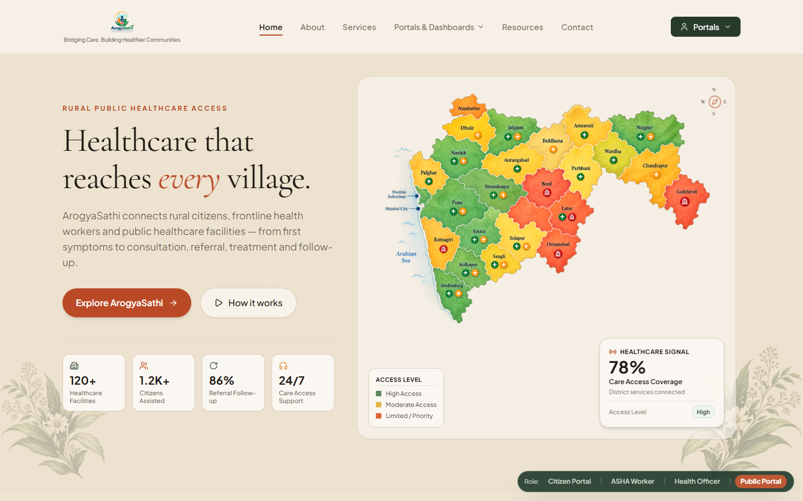
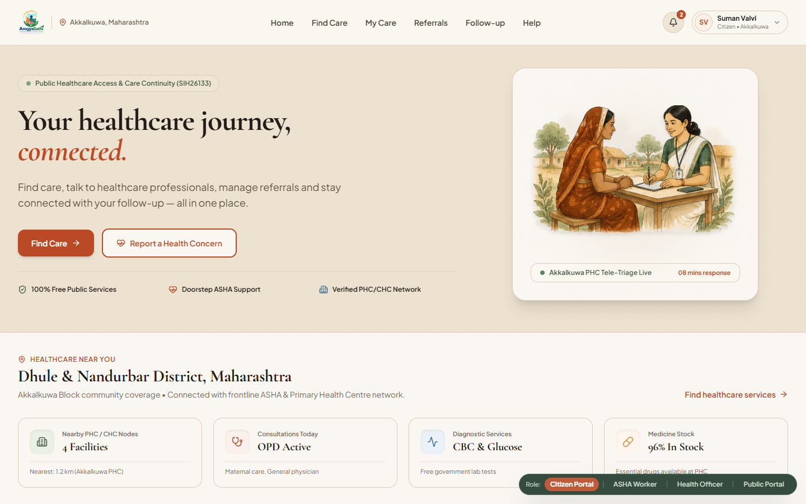
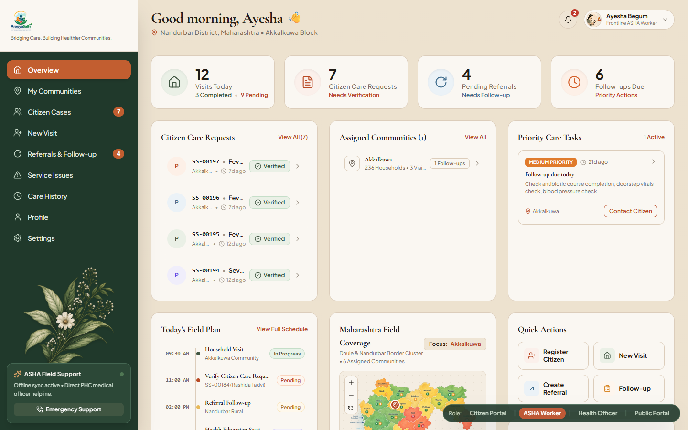
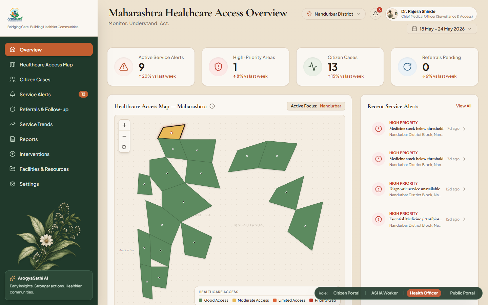

              # ArogyaSathi

              **Connecting Rural Citizens to Continuous Public Healthcare**

              [](https://www.sih.gov.in/)
              []()
              []()

              ArogyaSathi is a healthcare coordination platform prototype built for **Smart India Hackathon 2026** (Problem Statement: **SIH26133**). It addresses coordination gaps that prevent rural and underserved citizens from accessing continuous public healthcare services.

              The platform connects three key stakeholders through a structured operational workflow: **Citizen → ASHA Worker → Health Officer**. Citizens submit healthcare requests, frontline ASHA workers conduct doorstep triage and coordinate care, and district Health Officers monitor service alerts and authorize interventions — all backed by a shared PostgreSQL database providing state persistence across role views.

              

              ---

              ## Problem

              Rural and underserved communities in states like Maharashtra face persistent barriers to accessing public healthcare:

              - **No structured reporting channel** — Citizens lack a formal mechanism to log symptoms and receive tracked follow-up.
              - **Invisible frontline workload** — ASHA workers manage field tasks without a unified digital case view.
              - **Delayed triage** — Verification of citizen health concerns depends on informal communication without an auditable record.
              - **Fragmented referral chains** — Specialist referrals from Primary Health Centres (PHCs) to Community Health Centres (CHCs) or District Hospitals are tracked manually and often fall through.
              - **Administrative blindspots** — Health Officers lack consolidated, real-time visibility into district service gaps, stockouts, or staff vacancies.
              - **Disconnected coordination** — Consultations, diagnostics, prescriptions, and follow-ups operate in silos with no shared continuity record.

              ---

              ## Solution

              ArogyaSathi implements a role-based interface layer for three distinct actors in the public healthcare chain:

              ### Citizen Portal
              - Submit care requests with symptom descriptions, category selection, and preferred mode of care.
              - View care journey progression across seven stages: Request → Triage → Consultation → Diagnostics → Medicine → Referral → Follow-up.
              - Access active consultations, scheduled follow-ups, and specialist referrals.
              - View prescribed medicines, diagnostic test orders, and nearby healthcare facilities.
              - Receive notifications tied to clinical events and view assigned ASHA worker contact details.

              ### ASHA Worker Dashboard
              - View citizen care requests assigned to their community or block.
              - Conduct digital triage: record observed symptoms, severity grade (`Routine`, `Moderate`, `High Priority`), vitals check, ORS/first-aid provision, and field notes.
              - Manage household visits with community coverage tracking.
              - Track pending and completed specialist referrals and overdue follow-ups.
              - Log communal health education sessions and Jal Jeevan water quality inspections.
              - Escalate facility service issues (medicine stockouts, equipment failures, staff vacancies) to Health Officers.

              ### Health Officer Dashboard
              - Monitor district-level KPIs: active service alerts, high-priority geographic areas, active citizen cases, and referral backlogs.
              - Review escalated service alerts with severity classification and detailed context.
              - Authorize interventions against service issues, creating persisted intervention records and updating issue status.
              - View district access map driven by PostgreSQL analytical views.
              - Track weekly disease trend data and monitor facilities reporting zero active caseload.

              ### Public / Home Portal
              - Platform landing page displaying statistics drawn from the database (facility counts, citizen registrations, referral follow-up rate).
              - Explains the three-role operational model and provides navigation to role portals.

              ---

              ## Who Uses ArogyaSathi

              ```
                            ┌──────────────────────────────────────────────┐
                            │                CITIZEN PORTAL                │
                            │   Submits Care Request & Tracks Care Journey │
                            └──────────────────────┬───────────────────────┘
                                                 │
                                                 ▼
                            ┌──────────────────────────────────────────────┐
                            │             ASHA WORKER DASHBOARD            │
                            │   Doorstep Triage, Visits & Issue Escalation │
                            └──────────────────────┬───────────────────────┘
                                                 │
                                                 ▼
                            ┌──────────────────────────────────────────────┐
                            │           HEALTH OFFICER DASHBOARD           │
                            │ Surveillance, Service Alerts & Interventions │
                            └──────────────────────────────────────────────┘
              ```

              ---

              ## Core Workflow

              ```mermaid
              flowchart TD
              A[Citizen Submits Care Request] -->|Persisted: Pending| B[(PostgreSQL Database)]
              B --> C[ASHA Worker Receives Request]
              C --> D[ASHA Conducts Doorstep Triage]
              D -->|Persisted: Verified| E[(Triage Assessment Recorded)]
              E --> F{Severity Level}
              F -->|Routine| G[Schedule Follow-up]
              F -->|Moderate| H[Book PHC Consultation]
              F -->|High Priority| I[Initiate Specialist Referral]
              D -->|Service Issue Identified| J[Escalate Service Issue]
              J -->|Status: Reported| K[(Service Issue Recorded)]
              K --> L[Health Officer Reviews Alert]
              L --> M[Health Officer Authorizes Intervention]
              M -->|Status: Dispatch In Progress| N[(Intervention Record Persisted)]
              ```

              ---

              ## Key Features

              **Citizen**
              - Care request submission with symptom tagging and care mode selection.
              - 7-stage care journey progress tracker.
              - Active care panel for consultations, referrals, follow-ups, and prescriptions.
              - Diagnostic order history and results summary.
              - Nearby facility locator and notification inbox.

              **ASHA Worker**
              - Care request queue with triage status and severity indicators.
              - Digital triage form (vitals check, ORS provision, referral flags, field notes).
              - Household visit logs and village coverage tracking.
              - Referral and follow-up management panel.
              - Service issue escalation (medicine stockouts, equipment failure, staff vacancies).
              - Water quality inspection logging (Jal Jeevan surveillance) and health education session logs.

              **Health Officer**
              - District KPI overview (active alerts, high-priority areas, caseloads).
              - Service alert list with severity filter and full-detail modal.
              - Intervention authorization workflow (persists to DB, updates alert status).
              - District healthcare access map (driven by `v_district_access_kpis`).
              - Disease trend line chart and zero-activity facility monitoring (`v_facility_reporting_status`).

              ---

              ## Screenshots

              ### Public Portal

              

              *The public portal introduces the platform purpose, healthcare statistics, and role-based navigation.*

              ---

              ### Citizen Portal

              

              *The Citizen portal allows rural residents to request care, track their care journey, and view prescriptions and referrals.*

              ---

              ### ASHA Worker Dashboard

              

              *The ASHA interface enables frontline workers to conduct doorstep triage, manage household visits, track follow-ups, and escalate service issues.*

              ---

              ### Health Officer Dashboard

              

              *The Health Officer dashboard provides district surveillance, service issue alerts, access maps, and intervention authorization.*

              ---

              ## System Architecture

              ```
              React 18 + Vite 5               (client/ — Port 5173)
                     │
                     │  HTTP fetch (proxied via Vite dev server)
                     ▼
              REST API  /api/*
                     │
                     ▼
              Node.js 18+ + Express 4          (server/ — Port 5000)
                     │
                     │  node-postgres (pg) connection pool
                     ▼
              PostgreSQL 18                    (database: swasthyasetu)
              ```

              - **Client:** React SPA with hash-based view navigation (`#citizen`, `#asha`, `#officer`, `#home`). Component styling uses Tailwind CSS v3.
              - **Server:** Express application exposing REST endpoints mounted at `/api`. Controller logic handles DB interactions in `apiController.js`.
              - **Database:** PostgreSQL 18 relational schema utilizing `UUID` primary keys, native `ENUM` types, and 2 analytical views.

              ---

              ## Technology Stack

              | Layer | Technology | Version | Purpose |
              |---|---|---|---|
              | Frontend Framework | React | 18.3.x | Component-based user interface |
              | Frontend Build | Vite | 5.4.x | Development server and bundler |
              | CSS Framework | Tailwind CSS | 3.4.x | Utility-first styling |
              | UI Icons | Lucide React | 1.16.x | Interface icons |
              | Dashboard Charts | Recharts | 3.10.x | Data visualization |
              | Backend Runtime | Node.js | 18+ | JavaScript server runtime |
              | Backend Framework | Express | 4.19.x | REST API routing |
              | Database Driver | pg (node-postgres) | 8.12.x | PostgreSQL connection pool |
              | Database | PostgreSQL | 18 | Relational data store |
              | Environment Config | dotenv | 16.x | Environment variable management |
              | Dev Process Manager | nodemon | 3.1.x | Automatic server restart |

              ---

              ## Database

              The database contains **22 application tables** and **2 aggregate views**.

              ### Summary of Tables

              | Domain | Tables | Description |
              |---|---|---|
              | Geography & Community | `districts`, `blocks`, `communities`, `households` | Regional hierarchy and household coverage tracking |
              | Users & Roles | `users`, `asha_workers`, `citizens`, `health_officers`, `healthcare_facilities` | User accounts, role profiles, and facility registry |
              | Clinical Care Continuum | `care_requests`, `triage_assessments`, `consultations`, `prescriptions`, `diagnostic_orders`, `referrals`, `followups` | End-to-end clinical workflow tracking |
              | Frontline Operations | `household_visits`, `health_education_sessions`, `water_quality_reports` | Field logs and environmental surveillance |
              | Escalation & Alerts | `service_issues`, `interventions`, `notifications` | Facility issue escalation and administrative dispatches |

              ### Database Views

              - **`v_district_access_kpis`** — Aggregates facility counts, active cases, pending referrals, overdue follow-ups, and service alerts per district.
              - **`v_facility_reporting_status`** — Reports active caseload per facility to identify reporting gaps or unmonitored facilities.

              ---

              ## API Architecture

              The server exposes **27 REST endpoints** mounted under `/api`.

              ### Endpoints Summary

              ```
              Citizen APIs
              GET  /api/citizen/profile              Citizen profile and assigned ASHA
              GET  /api/citizen/notifications        Notification inbox
              GET  /api/citizen/active-care          Active care status and care journey
              GET  /api/citizen/medicines            Prescribed medicine list
              GET  /api/citizen/diagnostics          Diagnostic orders and test results
              GET  /api/citizen/nearby-facilities    Healthcare facilities list
              POST /api/citizen/care-requests        Submit a new care request

              ASHA Worker APIs
              GET  /api/asha/profile                 ASHA profile and community assignment
              GET  /api/asha/kpis                    Field operation KPIs
              GET  /api/asha/care-requests           Citizen care request queue
              GET  /api/asha/communities             Assigned communities and coverage
              GET  /api/asha/priority-tasks          Aggregated priority task list
              GET  /api/asha/referrals               Referrals and follow-ups panel
              POST /api/asha/triage                  Record triage assessment
              POST /api/asha/service-issues          Escalate facility service issue

              Health Officer APIs
              GET  /api/officer/districts            District list and status
              GET  /api/officer/kpis                 Officer dashboard KPIs
              GET  /api/officer/alerts               Service issue alert list
              GET  /api/officer/trends               Weekly disease trend data
              GET  /api/officer/priority-areas       Top high-priority districts
              GET  /api/officer/no-cases-facilities  Zero-caseload facilities list
              GET  /api/officer/ai-insight           Structured operational insights
              GET  /api/officer/map-districts        District map data and metrics
              GET  /api/officer/profile              Health Officer profile
              POST /api/officer/interventions        Authorize intervention dispatch

              Shared APIs
              GET  /api/health                       Backend server and database status
              GET  /api/home/stats                   Platform statistics for landing page
              ```

              ---

              ## End-to-End Demonstration

              The following workflow is fully functional in the implementation:

              1. **Citizen Request:** Citizen submits a healthcare request via the Citizen Portal (`POST /api/citizen/care-requests`).
              2. **Database Persistence:** Request is saved to `care_requests` with `status = 'Pending'`.
              3. **ASHA Queue:** Request appears in the ASHA Worker care request queue (`GET /api/asha/care-requests`).
              4. **Doorstep Triage:** ASHA submits triage assessment (`POST /api/asha/triage`), saving to `triage_assessments` and updating request to `Verified`.
              5. **Issue Escalation:** ASHA escalates a medicine stockout or facility issue (`POST /api/asha/service-issues`), creating a `service_issues` record (`status = 'Reported'`).
              6. **Officer Alert:** Health Officer views the alert on the dashboard (`GET /api/officer/alerts`).
              7. **Intervention Authorization:** Health Officer authorizes an intervention (`POST /api/officer/interventions`), creating an `interventions` record and updating issue status to `Dispatch In Progress`.

              ---

              ## Project Structure

              ```
              swasthyasetu/
              ├── client/                        React + Vite frontend
              │   ├── src/
              │   │   ├── App.jsx                Hash view router (citizen / asha / dashboard / home)
              │   │   ├── pages/                 Page views (Home, Citizen, AshaDashboard, Dashboard)
              │   │   ├── components/            Role components (citizen, asha, dashboard, home, ui)
              │   │   ├── services/api.js        API service layer with fallback mock data
              │   │   └── data/                  Synthetic mock data files
              │   ├── package.json
              │   └── vite.config.js             Vite config with /api proxy to localhost:5000
              │
              ├── server/                        Node.js + Express backend
              │   ├── src/
              │   │   ├── index.js               Express entry point
              │   │   ├── config/db.js           PostgreSQL connection pool
              │   │   ├── routes/api.js          27 REST endpoint definitions
              │   │   └── controllers/           Controller implementation (apiController.js)
              │   ├── .env.example               Environment configuration template
              │   └── package.json
              │
              ├── database/
              │   ├── seed.sql                   Idempotent seed script (22 tables)
              │   └── README.md                  Database setup guide
              │
              ├── docs/
              │   ├── database.md                Full PostgreSQL DDL script & schema decisions
              │   └── screenshots/               Application screenshot images
              │
              ├── ai-engine/                     Placeholder directory for future ML models
              ├── .gitignore
              └── README.md
              ```

              ---

              ## Getting Started

              ### Prerequisites

              - Node.js v18 or later
              - npm v9 or later
              - PostgreSQL 18

              ### Clone Repository

              ```bash
              git clone https://github.com/ATIFIXATION/swasthyasetu.git
              cd swasthyasetu
              ```

              ### Backend Setup

              ```bash
              cd server
              npm install

              # Create local environment configuration
              cp .env.example .env
              # Configure DB_PASSWORD in server/.env with your local PostgreSQL password

              npm run dev
              # Server starts at http://localhost:5000
              ```

              ### Frontend Setup

              ```bash
              cd client
              npm install
              npm run dev
              # Frontend starts at http://localhost:5173
              ```

              ---

              ## Database Setup

              ### Step 1: Create Database

              ```sql
              CREATE DATABASE swasthyasetu;
              ```

              ### Step 2: Apply Schema DDL

              Copy the DDL script from [docs/database.md](docs/database.md) (section: *Production PostgreSQL DDL Script*) and execute it against the `swasthyasetu` database to create all 22 tables and 2 views.

              ### Step 3: Load Seed Data

              Run `database/seed.sql` using `psql` or pgAdmin 4:

              ```powershell
              & "C:\Program Files\PostgreSQL\18\bin\psql.exe" -U postgres -d swasthyasetu -f database/seed.sql
              ```

              ---

              ## Technical Validation

              | Item | Count / Status |
              |---|---|
              | Database tables | 22 |
              | Database views | 2 (`v_district_access_kpis`, `v_facility_reporting_status`) |
              | REST API endpoints | 27 |
              | Role-based views | 4 (Citizen, ASHA Worker, Health Officer, Public Portal) |
              | UI components | 63 components across roles |
              | Transactional write workflows | 3 (Care request, Triage submission, Intervention authorization) |
              | Seed records | Synthetic demo data across 22 tables |

              ---

              ## Security & Data Privacy

              - Demonstration data is entirely synthetic; no real patient records or personal health information are used.
              - Environment variables (`.env`) manage database credentials and must never be committed to version control (`.env` is included in `.gitignore`).
              - Input validation is enforced in controller logic via enum checks and fallback defaults.

              > **Prototype Note:** User authentication, password verification, and JWT session management are planned for Phase 2. The prototype currently uses fixed UUID identifiers for demonstration role views.

              ---

              ## Roadmap

              ### Currently Implemented

              - Citizen care request submission and multi-stage care journey tracking.
              - ASHA digital triage, household visit tracking, follow-up management, and service issue escalation.
              - Health Officer service alert monitoring and intervention authorization workflow.
              - District KPI aggregation via PostgreSQL views.
              - 27 REST API endpoints with PostgreSQL persistence and client fallback mock data.
              - 22-table relational schema with synthetic seed script.

              ### Planned (Phase 2+)

              - **Authentication & Authorization** — User login flow, JWT session management, and role-based route protection.
              - **Hindi / Marathi Localization** — Multilingual support for frontline health workers and citizens.
              - **Offline Sync Queue** — Client PWA sync queue for low-connectivity field tablets.
              - **Facility Medicine Ledger** — SKU-level inventory tracking for healthcare facilities.
              - **Doctor Roster Schedules** — Structured availability calendars for facility medical officers.
              - **AI / ML Pipeline** — Live machine learning models for risk stratification in `ai-engine/`.
              - **ABDM Integration** — Integration with Ayushman Bharat Digital Mission APIs.

              ---

              ## Smart India Hackathon 2026

              | Parameter | Value |
              |---|---|
              | **Problem Statement** | SIH26133 |
              | **Theme** | MedTech / BioTech / HealthTech |
              | **Focus Area** | Accessibility and quality of public healthcare services in rural and underserved areas |
              | **Prototype Type** | Functional web prototype with database persistence |

              ---

              ## Team

              **Team Name:** [TO BE UPDATED]  
              **Smart India Hackathon 2026 Submission** — Problem Statement SIH26133  

              ---

              ## Disclaimer

              ArogyaSathi is a prototype developed for Smart India Hackathon 2026.

              - All demonstration data is synthetic and generated solely for functional testing.
              - Data does not represent real medical records of any individual.
              - This platform is not a substitute for professional medical diagnosis or emergency medical services.
              - Operational insights in the Health Officer dashboard are based on pre-defined structured data and are not produced by a live machine learning model.
